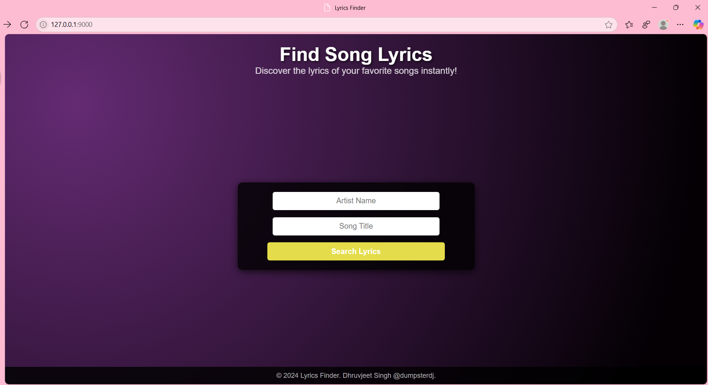
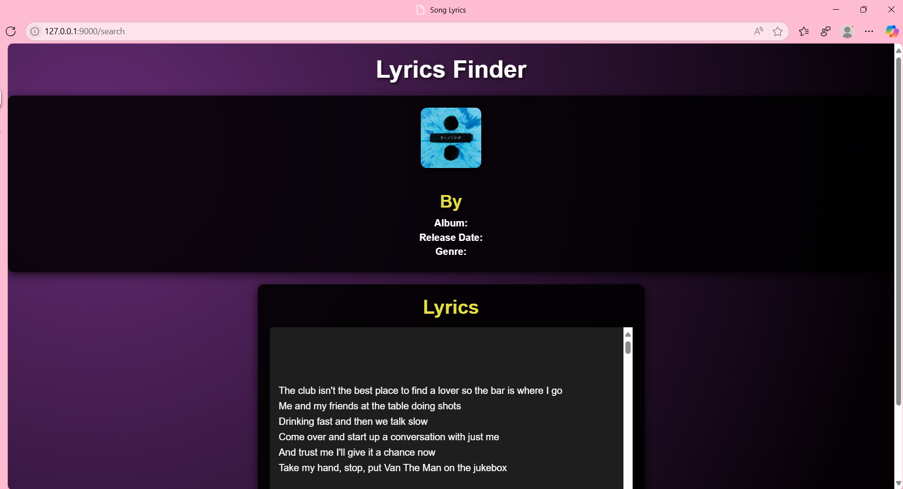

# **Lyrics Finder Web App**

🎵 **Lyrics Finder** is a sleek and professional web application that allows users to search for song lyrics and view album metadata, including cover art, album name, genre, and release date. Built using **FastAPI**, this app integrates with multiple APIs (e.g., Lyrics.ovh and iTunes) to deliver a seamless and enjoyable user experience.

---

## **Features**

- 🌟 Search for song lyrics by providing the song title and artist name.
- 🎤 View album details such as:
  - Album name
  - Release date
  - Genre
  - High-quality cover art
- 🎧 Play a 30-second preview of the song (if available).
- 🎨 Stylish and responsive UI with a modern gradient theme.
- 🛠️ Built with scalable and modular architecture for easy enhancements.

---

## **Technologies Used**

- **Backend**: [FastAPI](https://fastapi.tiangolo.com/)
- **Frontend**: HTML5, CSS3, JavaScript
- **APIs**:
  - [Lyrics.ovh](https://lyricsovh.docs.apiary.io/) for fetching song lyrics.
  - [iTunes API](https://developer.apple.com/library/archive/documentation/AudioVideo/Conceptual/iTuneSearchAPI/) for song metadata and cover art.
- **Database**: SQLite (optional, for caching lyrics and metadata)
- **Styling**: Responsive CSS with gradients and animations.

---

## **Installation**

### **1. Clone the Repository**
```bash
git clone https://github.com/dumpsterdj/LyricsFinder.git
cd LyricsFinder
```

### **2. Set Up a Virtual Environment**
```bash
python -m venv env
source env/bin/activate  # On Windows: env\Scripts\activate
```

### **3. Install Dependencies**
```bash
pip install -r requirements.txt
```

### **4. Run the Application**
```bash
uvicorn main:app --reload
```

### **5. Access the App**
Open your browser and navigate to:  
[http://127.0.0.1:8000](http://127.0.0.1:8000)

---

## **Project Structure**

```
Lyrics Finder/
├── static/
│   ├── style.css            # Styling for the web app
│   ├── script.js            # JavaScript animations
│
├── templates/
│   ├── home.html            # Homepage template for search
│   ├── lyrics.html          # Results page template
│
├── coverimg.py              # Fetch song metadata and cover images from iTunes API
├── main.py                  # Entry point for the application
├── requirements.txt         # Dependencies for the project
├── README.md                # Project documentation
```

---

## **How It Works**

1. **Search for a Song**:
   - Enter the artist name and song title on the homepage.

2. **Fetch Lyrics and Metadata**:
   - The app queries the Lyrics.ovh API for lyrics and the iTunes API for song metadata.

3. **View Results**:
   - Lyrics and metadata (album, release date, genre, etc.) are displayed along with the album cover.

4. **Preview the Song**:
   - If available, listen to a 30-second song preview using the provided audio controls.

---

## **Screenshots**

### **Homepage**
A sleek and user-friendly search page:


### **Lyrics Page**
Lyrics, album metadata, and cover art presented professionally:


---

## **Future Enhancements**

- 🌐 Multi-language support for lyrics.
- 💾 Add caching for faster search results.
- 🔍 Advanced search options (e.g., by genre or album).
- 🌟 User accounts for saving favorite songs.
- 📊 Analytics dashboard to track popular searches.

---

## **Contributing**

Contributions are welcome! Please fork the repository and submit a pull request.

---

## **License**

This project is licensed under the MIT License. See the [LICENSE](LICENSE) file for details.

---

## **Acknowledgements**

- APIs: [Lyrics.ovh](https://lyricsovh.docs.apiary.io/) and [iTunes API](https://developer.apple.com/library/archive/documentation/AudioVideo/Conceptual/iTuneSearchAPI/)
- Framework: [FastAPI](https://fastapi.tiangolo.com/)
- Inspired by music enthusiasts worldwide. 🎵
